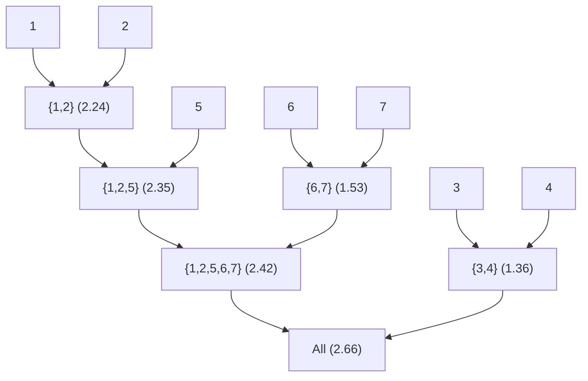
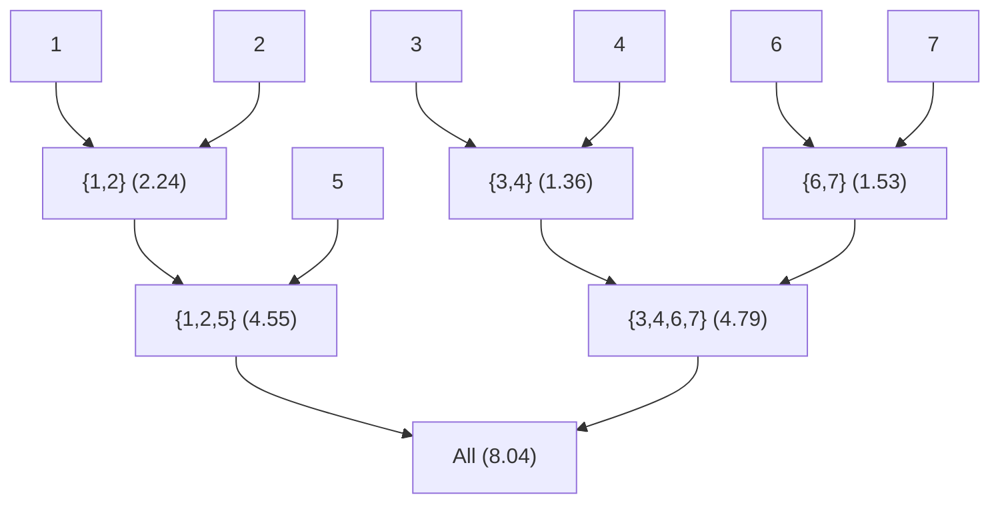

### Problem 17

#### Task a

1. 

K-means is an **unsupervised clustering algorithm**, so it is used to find groups (clusters) in data **without pre-existing labels**

2. 

Inputs:

Number of clusters

Data points

Outputs:

Cluster assignments

Cluster centroids

3. 

Each cluster represents a group of similar data points.

The centroid of each cluster represents the “average” point in that cluster.

The assignment tells you which points are most similar to each centroid.

The algorithm minimizes within-cluster variance

#### Task b

$$
Cost = \sum_{i=1}^k\sum_{x∈C_i}||x-\mu_i||^2
$$

k = number of clusters

Ci = set of points assigned to cluster i

μi = centroid (mean) of cluster i


During iterations: Cost never increases, it monotonically decreases until convergence

#### Task c

- Initial centroids

  μ1=(1,4),μ2=(4,1)

  - assign to μ1
    - Point 1: (0,1)
    - Point 2: (1,2)
    - Point 3: (4,5)
  - assign to μ2
    - Point 4: (5,3)
    - Point 5: (5,4)
  - Update centroids
    - μ1 = (1.67,2.67)
    - μ2= (5,3.5)
  - Cost = 17.82

- Iteration 1

  - assign to μ1
    - Point 1: (0,1)
    - Point 2: (1,2)
  - assign to μ2
    - Point 4: (5,3)
    - Point 5: (5,4)
    - Point 3: (4,5)
  - Update centroids
    - μ1 =(0.5,1.5)
    - μ2= (4.67,4)
  - Cost = 3.66

- Iteration 2

  - assign to μ1
    - Point 1: (0,1)
    - Point 2: (1,2)
  - assign to μ2
    - Point 4: (5,3)
    - Point 5: (5,4)
    - Point 3: (4,5)
  - no change
  - Cost = 3.66

### Problem 18

#### Task a



#### Task b



- Single-link 
  - merges two clusters if any pair of points in the clusters are very close.
  - It tends to form long, narrow clusters, which may become quite elongated and not compact.

- Complete-link 
  - merges two clusters only if all points in the clusters are sufficiently close.
  - The clusters are more compact and have a more spherical or regular shape.

### Problem 19

#### Task a

```python
import pandas as pd
from sklearn.cluster import KMeans
from sklearn.preprocessing import StandardScaler
import matplotlib.pyplot as plt

# read data
df = pd.read_csv("./data/train.csv")

# filter features end with mean
mean_cols = [col for col in df.columns if col.endswith(".mean")]
X = df[mean_cols]

# standardization
scaler = StandardScaler()
X_scaled = scaler.fit_transform(X)

# compute k-mean loss
inertia = []
K_range = range(1, 20)

for k in K_range:
    km = KMeans(n_clusters=k, random_state=0)
    km.fit(X_scaled)
    inertia.append(km.inertia_)

# plot
plt.plot(K_range, inertia, marker="o")
plt.xlabel("Number of clusters (k)")
plt.ylabel("K-means loss (inertia)")
plt.title("Elbow Method for K-means")
plt.show()
```


**Should you normalise the columns?** 

Yes.
 K-means is distance-based, and variables with large scales dominate the Euclidean distance. Since the dataset contains features with very different magnitudes, standardization is necessary

**What effect does the normalisation of the columns have?**

It gives all features equal weight in the distance computation and prevents high-magnitude variables

#### Task b

```python
# read data
df = pd.read_csv("./data/train.csv")

# get .mean features
mean_cols = [col for col in df.columns if col.endswith(".mean")]
X = df[mean_cols]
y = df["class4"].astype('category').cat.codes

# standardization
scaler = StandardScaler()
X_scaled = scaler.fit_transform(X)

# 4-class clusters
kmeans = KMeans(n_clusters=4, random_state=0)
clusters = kmeans.fit_predict(X_scaled)

# confusion matrix
C = confusion_matrix(y, clusters)

# find best Permutations
best_perm = None
best_sum = -1

for perm in permutations(range(4)):
    M = C[:, perm]
    s = np.trace(M)
    if s > best_sum:
        best_sum = s
        best_perm = perm

C_aligned = C[:, best_perm]

print("Best column order:", best_perm)
print("Confusion matrix aligned:\n", C_aligned)
print("Diagonal sum (maximized):", np.trace(C_aligned))
```

```shell
Best column order: (3, 2, 0, 1)
Confusion matrix aligned:
 [[ 32   0  72  13]
 [  1   0  20   5]
 [ 15   0  63   4]
 [100   4  14 107]]
Diagonal sum (maximized): 202
```

The largest errors occur for Class 4, which is heavily split across multiple clusters
(100 observations assigned to Cluster 1 and 14 to Cluster 3)

A second major source of error is the confusion between Class 1 and Class 3.
Class 1 has 72 points assigned to Cluster 3, and Class 3 has 15 points assigned to Cluster 1.

Class 2 is almost never correctly identified: it has zero diagonal count, meaning k-means fails to form a cluster corresponding uniquely to Class 2.

#### Task c

##### i

```python
# random initialisations
losses = []

for i in range(1000):
    kmeans = KMeans(
        n_clusters=4,
        init="random",
        n_init=1,
        random_state=None
    )
    kmeans.fit(X_scaled)
    losses.append(kmeans.inertia_)   # inertia = k-means loss

losses = np.array(losses)

# plot
plt.hist(losses, bins=30)
plt.xlabel("K-means loss")
plt.ylabel("Frequency")
plt.title("Loss distribution across 1000 random initialisations")
plt.show()
```


```shell
Min loss: 10646.871669424881
Max loss: 12431.943027930483
Best loss: 10646.871669424881
Threshold for 'reasonably good': 10753.340386119131
Number of good solutions: 48
```

Out of the 1000 random initialisations, 48 runs produced a loss within 1% of the best loss.
 This corresponds to a probability of 0.048, which means that on average we would need approximately 20.8 random initialisations to obtain one reasonably good solution.

##### ii

```python
for i in range(1000):
    kmeans = KMeans(
        n_clusters=4,
        # init="random",
        init="k-means++",
        n_init=1,
        random_state=None
    )
    kmeans.fit(X_scaled)
    losses.append(kmeans.inertia_) 
```

```shell
Min loss: 10646.871669424881
Max loss: 12429.23967182942
Best loss: 10646.871669424881
Threshold for 'reasonably good': 10753.340386119131
Number of good solutions: 409
```

This demonstrates that k-means++ produces far more stable and reliable results, because it chooses initial centroids that are spread out in the data space, making k-means less likely to converge to a poor local minimum

#### Task d

```python
# compute linkage matrix
linkage_methods = ['ward', 'complete']

for method in linkage_methods:
    Z = linkage(X_scaled, method=method)

    # plot dendrogram
    plt.figure(figsize=(12, 6))
    plt.title(f"Dendrogram ({method} linkage)")
    dendrogram(Z, no_labels=True, count_sort='ascending')
    plt.show()

    # divide into 4 categories
    cluster_model = AgglomerativeClustering(n_clusters=4, linkage=method)
    clusters = cluster_model.fit_predict(X_scaled)

    # confusion matrix
    C = confusion_matrix(y, clusters)
    print(f"\nConfusion matrix ({method} linkage):\n", C)
```


```shell
Confusion matrix (ward linkage):
 [[ 82   8   0  27]
 [ 20   5   0   1]
 [ 69   4   0   9]
 [ 33 106   4  82]]

Confusion matrix (complete linkage):
 [[  9 108   0   0]
 [  5  21   0   0]
 [  4  78   0   0]
 [110 111   2   2]]
```


Ward linkage produces more balanced and compact clusters. The confusion matrix shows that while Class1 and Class4 are relatively well captured, Class2 and Class3 are often misclassified. The clusters tend to be more evenly sized due to the minimization of within-cluster variance.

Complete linkage produces highly unbalanced clusters. Most samples from all classes are merged into a single large cluster, leading to almost no correct classifications on the diagonal. This happens because Complete linkage considers the maximum distance between clusters and is sensitive to outliers, causing irregular and elongated clusters.

Ward clustering produces more balanced clusters with smaller size variations. Complete linkage clustering results in clusters with significant size differences, some clusters may be very small or very large.

### Problem 20

#### Task a


#### Task b


**Why does unnormalized data seem to have fewer components explaining more variance?**

- Without scaling, features with **larger numerical ranges dominate the variance**.
  - Example: `CO2` might have values in hundreds, while `UV_A` is small.
- PCA finds directions of **maximum variance**. So, large-range features dominate the first few components.
- After scaling (zero mean, unit variance), **all features contribute equally**, so variance spreads across more components.

#### Task c

```python
import pandas as pd
import numpy as np
from sklearn.model_selection import train_test_split
from sklearn.preprocessing import StandardScaler
from sklearn.decomposition import PCA
from sklearn.ensemble import RandomForestClassifier
from sklearn.metrics import accuracy_score

# Load data
df = pd.read_csv("./data/train.csv")
X = df.drop(columns=["id", "date", "class4", "partlybad"])
y = df["class4"]

# Standardize features
scaler = StandardScaler()
X_scaled = scaler.fit_transform(X)

# Split data into 50% training, 50% validation
X_train, X_val, y_train, y_val = train_test_split(
    X_scaled, y, test_size=0.5, random_state=42, stratify=y
)

# Random Forest classifier
clf = RandomForestClassifier(n_estimators=100, random_state=42)
clf.fit(X_train, y_train)

# Predict on validation set
y_pred = clf.predict(X_val)
acc = accuracy_score(y_val, y_pred)
print(f"Validation accuracy without PCA: {acc:.4f}")

# Try different numbers of PCA components
component_range = list(range(1, X_train.shape[1] + 1))
pca_acc = []

for n_comp in component_range:
    pca = PCA(n_components=n_comp)

    # Fit PCA on combined training + validation (semi-supervised)
    X_combined = np.vstack([X_train, X_val])
    pca.fit(X_combined)

    # Transform training and validation sets
    X_train_pca = pca.transform(X_train)
    X_val_pca = pca.transform(X_val)

    # Train classifier
    clf = RandomForestClassifier(n_estimators=100, random_state=42)
    clf.fit(X_train_pca, y_train)

    # Evaluate
    y_pred = clf.predict(X_val_pca)
    pca_acc.append(accuracy_score(y_val, y_pred))

# Find optimal number of components
optimal_idx = np.argmax(pca_acc)
optimal_components = component_range[optimal_idx]
optimal_accuracy = pca_acc[optimal_idx]

print(f"Optimal PCA components: {optimal_components}")
print(f"Validation accuracy with PCA: {optimal_accuracy:.4f}")

# Plot accuracy vs number of components
import matplotlib.pyplot as plt

plt.figure(figsize=(10, 6))
plt.plot(component_range, pca_acc, marker='o')
plt.axhline(acc, color='red', linestyle='--', label='No PCA Accuracy')
plt.xlabel('Number of PCA Components')
plt.ylabel('Validation Accuracy')
plt.title('Classifier Performance vs PCA Dimensionality')
plt.legend()
plt.grid(True)
plt.show()
```


Without PCA: The classifier uses all features, giving baseline accuracy.

With PCA: Accuracy may initially increase, then it started to float up and down.

### Problem 21

In lectures 9–12, I deepened my understanding of core unsupervised learning techniques, especially clustering and dimensionality reduction. From k-means and hierarchical clustering, I learned how different distance metrics and initialization choices strongly affect the clustering results. The hierarchical clustering discussion helped me understand dendrograms better, especially the idea that vertical distance—not horizontal proximity—describes similarity, which corrected a misconception I previously had. 

The dimensionality reduction lectures clarified both the purpose and limitations of PCA. I had often used PCA as a tool for preprocessing but didn’t fully understand how principal components are constructed as orthogonal directions of maximal variance. The quiz questions made me pay attention to details such as the importance of centering data before PCA and the fact that principal components may not be unique when variances are equal. The exercises P20–P21 helped me connect theory to visual intuition by comparing scatter plots before and after PCA transformation.
